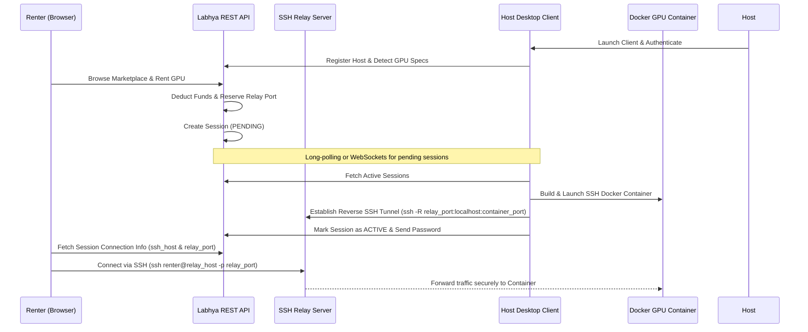

# Labhya Compute — Decentralized GPU Renting Platform

[](https://opensource.org/licenses/MIT)
[](https://www.python.org/)
[](https://nextjs.org/)
[](https://www.postgresql.org/)
[](https://www.docker.com/)

Labhya Compute is a production-grade, decentralized GPU computing platform that connects individuals who need GPU power (**Renters**) with individuals who have idle GPU resources (**Hosts**). 

The platform enables Hosts to securely lease out their hardware through a lightweight desktop client that automatically spins up Dockerized SSH containers. Renters can search the marketplace, lease GPU instances by the hour, deposit funds via an integrated wallet system, and connect directly to their private GPU environments using standard SSH or Jupyter terminals.

---

## 🏗️ System Architecture

The platform consists of three main components:
1. **Django REST API (Backend)**: Coordinates sessions, manages user roles, handles ledger/wallet balances, leases relay ports, and stores metrics.
2. **Next.js Web Portal (Frontend)**: Offers a modern UI for renter marketplace searches, transaction logs, active session management, and host dashboard statistics.
3. **Host Agent (Desktop GUI)**: Automatically detects native GPU hardware, builds/launches isolated Docker containers for renters, and creates reverse SSH tunnels back to the relay server to bypass NAT/firewalls.



---

## ⚡ Quick Start

### 🐳 The Quickest Way: Docker Compose (All-in-One)
The root of the repository includes a pre-configured `docker-compose.yml` that mounts a PostgreSQL database, runs migrations, compiles static files, and starts the Django and Next.js services automatically.

1. **Clone the Repository**:
   ```bash
   git clone https://github.com/your-username/Labya_compute.git
   cd Labya_compute
   ```

2. **Launch Services**:
   ```bash
   docker compose up --build
   ```
   * Access the Next.js Frontend at: `http://localhost:3000`
   * Access the Django API Backend at: `http://localhost:8000`
   * Access the Django Admin Dashboard at: `http://localhost:8000/admin`

---

### 🛠️ Manual Development Setup

If you prefer to run services manually for local debugging:

#### 1. Database (PostgreSQL)
Ensure you have a running PostgreSQL instance and create a database named `labhya_compute`. Or, if no database variables are provided, Django will fall back to local `SQLite3` automatically for zero-config development.

#### 2. REST API Backend
```bash
cd backend
python -m venv venv
# On Windows: venv\Scripts\activate  |  On Unix: source venv/bin/activate
pip install -r requirements.txt

# Run migrations & seed db
python manage.py migrate
python manage.py createsuperuser

# Start development server
python manage.py runserver
```

#### 3. Next.js Frontend
```bash
cd frontend
npm install
npm run dev
```
Open `http://localhost:3000` in your browser.

#### 4. Desktop Host Agent
```bash
cd backend/agent
pip install requests
python agent_gui.py
```
*Note: The agent client requires a working installation of **WSL2** (on Windows), **Docker Desktop**, and **OpenSSH Client**.*

---

## 📂 Codebase Directory Structure

```text
├── backend/                       # Django Backend Root
│   ├── labhya_compute/            # Main Django Settings and URL routing
│   ├── api/                       # DRF Application (Models, Serializers, Views)
│   ├── agent/                     # Host Desktop Client application
│   │   ├── docker/                # Docker templates for Renter environments
│   │   └── agent_gui.py           # Tkinter-based Host Desktop GUI client
│   ├── requirements.txt           # Python backend dependencies
│   └── Dockerfile                 # Production Dockerfile for Django
│
├── frontend/                      # Next.js Frontend Root
│   ├── app/                       # Page layouts & router directories
│   ├── components/                # Reusable UI component libraries (shadcn/Radix)
│   ├── lib/                       # API clients, auth stores, and utilities
│   ├── package.json               # Frontend dependencies & package config
│   └── Dockerfile                 # Production Dockerfile for Next.js
│
└── docker-compose.yml             # Local / Production Container Orchestrator
```

---

## 🗄️ Database Schema & Models

The REST API utilizes the following core schema entities:

| Model | Description |
| :--- | :--- |
| **`User`** | Django auth user representing the core profile (email, password). |
| **`Host`** | Profile extensions representing individuals supplying GPU machines. |
| **`Renter`** | Profile extensions representing individuals hiring GPU machines. |
| **`Wallet`** | Balances ledger associated with either a `Host` or a `Renter` (defaults to NPR currency). |
| **`Transaction`** | Ledger entries tracking Deposits, Withdrawals, Rental Payments, and Earnings. |
| **`GPU`** | Hardware details (Name, VRAM, pricing rate, availability status, geo-location). |
| **`Session`** | Historical or active lease agreements tracking duration, SSH credentials, connection state, and live GPU telemetry metrics (temperature, load). |
| **`RelayPort`** | Relational lease table locking port ranges (e.g., `8001-8999`) on the relay server to prevent connection collisions. |

---

## ⚙️ Environment Configurations

### Django API Backend
You can configure the backend service using the following environment variables:

| Variable | Description | Default |
| :--- | :--- | :--- |
| `DJANGO_SECRET_KEY` | Private secret key used for session signing and hashing. | *Generated Dev Key* |
| `DJANGO_DEBUG` | Enable developer logs and traceback screens. | `True` |
| `DJANGO_ALLOWED_HOSTS` | Comma-separated list of allowed request domains. | `*` |
| `DJANGO_CORS_ALLOWED_ORIGINS`| Comma-separated list of CORS authorized web apps. | *Allow All* |
| `DATABASE_URL` | SQLAlchemy-style PostgreSQL database connection URI. | *SQLite fallback* |
| `RELAY_HOST` | Hostname/IP address of the SSH relay server. | `localhost` |
| `RELAY_PORT_RANGE_START` | Initial port in the reserved SSH tunnel range. | `8001` |
| `RELAY_PORT_RANGE_END` | Terminal port in the reserved SSH tunnel range. | `8999` |

### Next.js Frontend
Configure the frontend to direct API traffic:

| Variable | Description | Default |
| :--- | :--- | :--- |
| `NEXT_PUBLIC_API_URL` | Absolute base URL directing requests to Django REST API. | `http://localhost:8000/api` |

---

## 🚀 Production Deployment Considerations

1. **Security Settings**: Set `DJANGO_DEBUG=False` in your hosting environment. Ensure `DJANGO_SECRET_KEY` is set to a long, randomized string.
2. **Reverse SSH Relay Server**:
   In production, you must set up an external OpenSSH server configured to allow port forwarding gateway ports:
   Edit `/etc/ssh/sshd_config` on your relay/bastion server:
   ```text
   GatewayPorts yes
   ClientAliveInterval 60
   ClientAliveCountMax 3
   ```
3. **SSL Certificate**: Always serve both backend and frontend applications behind HTTPS using a reverse proxy like Nginx, Traefik, or cloud hosting integrations (Cloudflare, Render, AWS ALBs).
4. **Static Assets**: Backend static assets are served using `whitenoise`. Running `python manage.py collectstatic --noinput` during your deployment build phase compiles these automatically.
